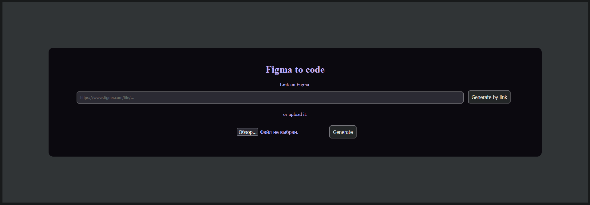
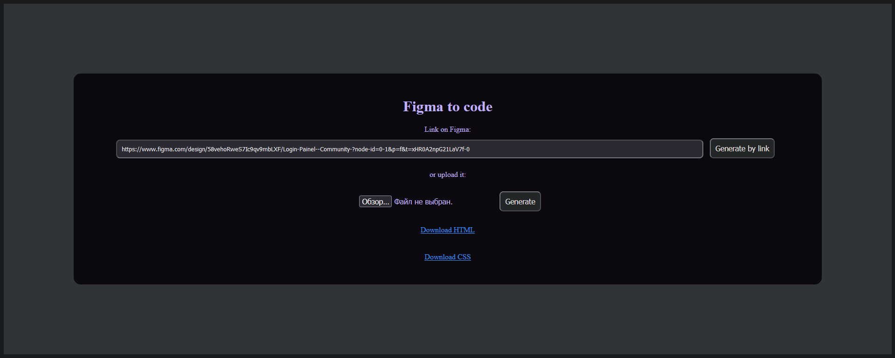
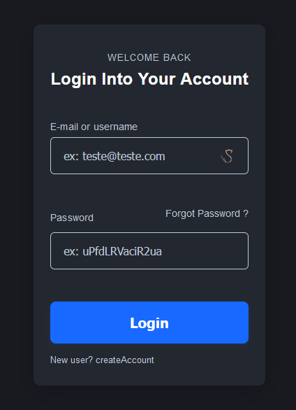

# AI-Powered Figma to Code Converter

A fully local tool that transforms Figma designs into modern, clean HTML and CSS using AI (GPT)

---

## Features

- Supports both Figma URL and uploaded `.json` file
- Integration with OpenAI GPT-3.5-turbo for intelligent HTML structure generation
- Dark theme CSS generation with modern layout principles
- Automatically detects and describes Figma elements (TEXT, INPUT, BUTTON)
- Instantly generates and offers downloads for `result.html` and `result.css`
- Unlike many existing services, our script works locally, requires no registration, and gives full control over the output
- The HTML structure is optimized — we avoid overly nested layers, which is a common issue with tools like Locofy
- Our approach is more flexible — the generated code can be used with any framework, not just React like in Builder.io
- Transformer Models (e.g., GPT, T5, or Vision Transformers):
  - Generating structured front-end code from Figma JSON data
  - Automating responsiveness and accessibility features

---

## Preview

| Upload UI         | With URL + Download | Generated Page    |
| ----------------- | ------------------- | ----------------- |
|  |    |  |

---

## Structure

- `index.html` — user interface for uploads
- `script.js` — frontend logic
- `style.css` — frontend styling
- `server.js` — Express backend
- `parser/ai.js` — AI logic for HTML/CSS generation
- `result.html`, `result.css` — generated output files

---

## How to run

1. Install dependencies:
   ```bash
   npm install express axios express-fileupload cors dotenv
   ```

2. Create a `.env` file in the project root:
   ```env
   OPENAI_API_KEY=sk-xxx...
   FIGMA_TOKEN=figd_...
   ```

3. Start the server:
   ```bash
   node server.js
   ```

4. Open in browser:
   ```
   http://localhost:3000
   ```

---

## How it works

1. The user provides a Figma URL or uploads the design JSON
2. The backend fetches or reads the JSON
3. `ai.js` extracts and summarizes component structure
4. A prompt is sent to GPT describing the layout
5. GPT returns HTML + CSS which are saved as downloadable files

---

## Example

- Input: Login page (Figma)
- Output: Visually matching responsive HTML page with form and dark styling

---

## Technologies

- Node.js + Express
- OpenAI GPT-3.5 API
- HTML5 / CSS3
- Figma REST API